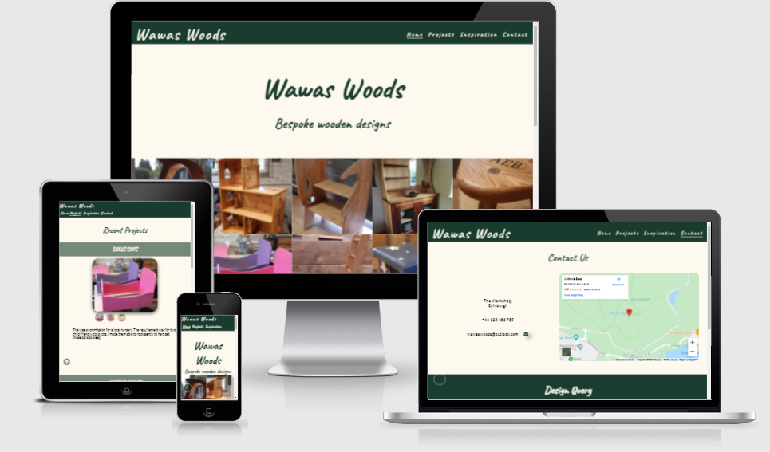
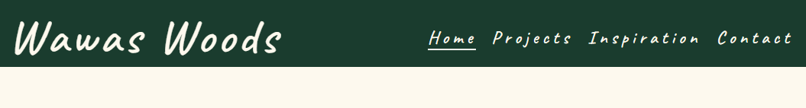
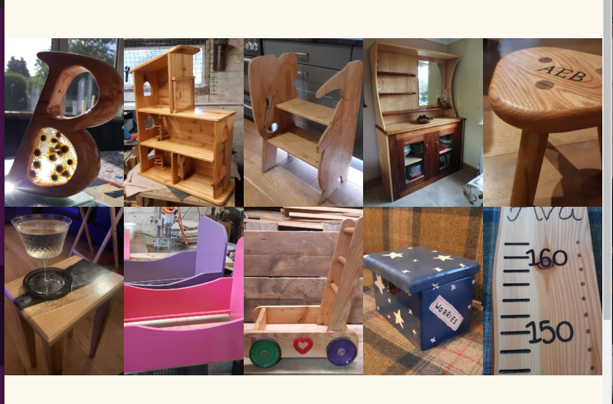
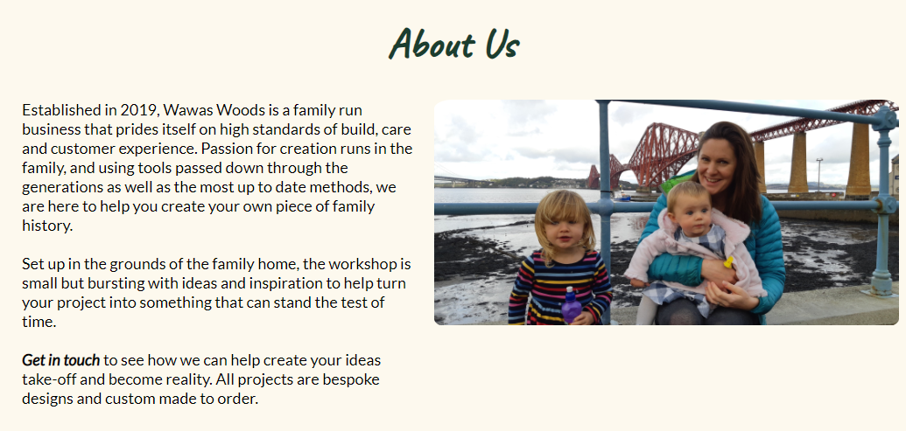
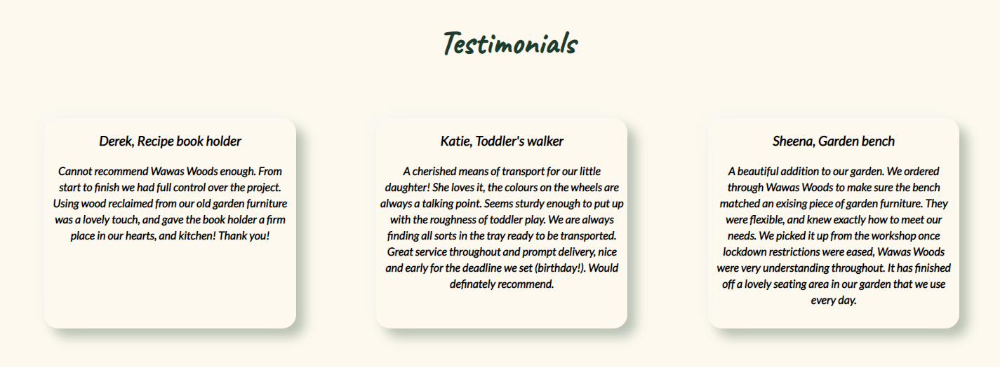
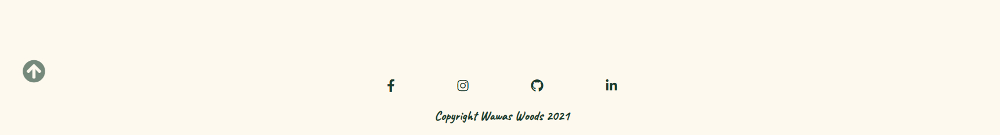

# Wawas Woods

Wawas Woods is a small business set up to create custom made wooden items. The site is targeted at the prospective buyer who is in the market for something tailored to their exacting requirements. Wawas Woods will be useful to help guide people throught from project inception to delivery.

Welcome to the journey through [Wawas Woods](https://ewancolquhoun.github.io/wawaswoods/)

## Features
---
Wawas Woods site is set up to be welcoming and easy to use. It contains many features that the user would be probably be familiar with. The overall feel of the website is intended to be inviting and not intimidating to encourage the user to explore further.   
The color scheme, dark green and cream was chosen to contrast with the tan color of the wood in the materials and also provides a welcoming look to the site.

### Existing Features  
  * Styling
    * The color scheme, dark green and cream was chosen to contrast with the tan color of the wood in the materials and also provides a welcoming look to the site.
    * To aid with the inviting feel of the site a cursive style was chosen for the headings and sans-serif for the text body. The font chosen were; Caveat and Lato.

  * Navigation Menu

    * Sited at the top of all the pages in the site It is fully responsive and contains links to all the pages of the site to enable ease of navigation in one convenient location.
    * The logo is clickable with a link back to the home page for enhanced UX.

  * Gallery

      * Located on the home page beneath the title section. It was intended to make the title section relatively plain to enable a focus on the images in the gallery.
      * A Responsively stlyed grid of images of past projects to give the user the idea of what is possible.

  * About Us section

    * The About Us section lets the user know what Wawas Woods is and who we are. 
    * The combination of a family picture and the text will draw the user in further by instilling a confidence that the project will be taken care off by a small family business.
    * An inbedded link to the contact section in the text will help the user navigate quickly to the next step of the project process.

  * Testimonials section

    * The testimonials section provides the user with some feeback from previous clients. There are three testimonials displayed giving a name, project name and some text.
    * They are styled with a box shadow to 'detach' them from the site to instill a sense of impartiality in th user.

* Footer
    
    * Contains social media links. To enhance the UX the links open in other tabs
    * The social medial presence will help the user with their research into Wawas Woods and will also encourage them to connect with Wawas Woods on social media.
    * To help the user with navigation on all devices a 'scroll to the top' arrow was added. It sticks to the bottom left of the screen at all times to give the user a quick and unobstructed way to the navigation bar. The arrow is semi-transparent with a light/dark contrasting border for use against all backgroundcolours.
    
