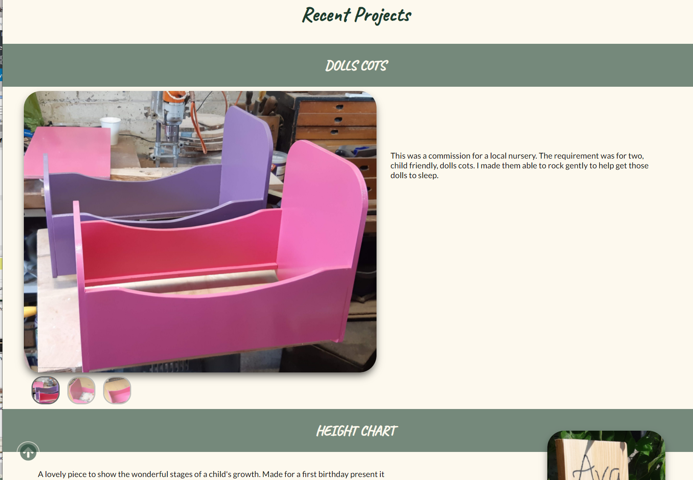
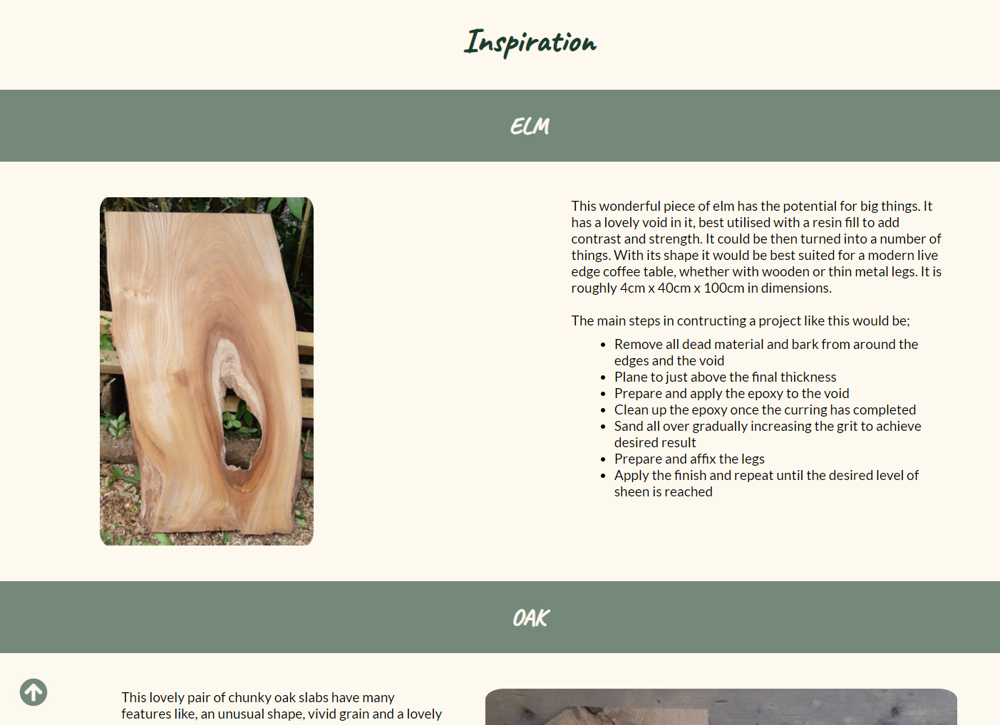
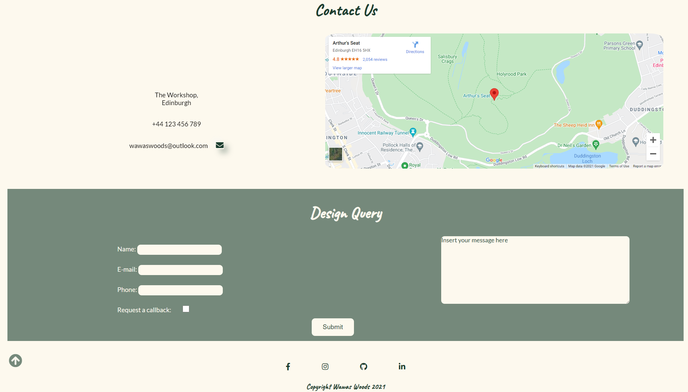
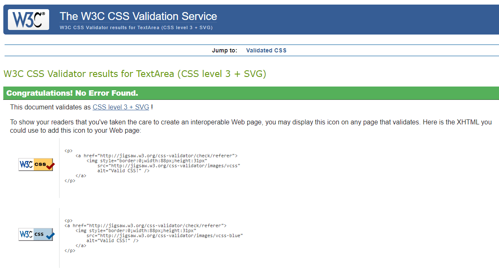

# **Wawas Woods**

Wawas Woods is a small business set up to create custom made wooden items. The site is targeted at the prospective buyer who is in the market for something tailored to their exacting requirements. Wawas Woods will be useful to help guide people through from project inception to delivery.

Welcome to the journey through <a href="index.html" target=_blank>Wawas Woods</a>

# User Stories (not complete)

As a user...

# Wireframes (not complete)

The wireframes for Wawas Woods were produced in [Balsamiq](https://balsamiq.com). There are frames for a full width display and a small mobile device. The final site varies slightly from the wireframes due to developments that occured during the creation process. 

image of wireframes. 

# Features

Wawas Woods site is set up to be welcoming and easy to use. It contains many features that the user would probably be familiar with, such as a navigation bar and contact form. The overall feel of the website is intended to be inviting and not intimidating to encourage the user to explore further. 

#### [Home](#nav-menu)
  * [Navigation menu](#nav-menu)
  * [Gallery](#gallery)
  * [Testimonials](#testimonials)
  * [Footer](#footer)
#### [Projects](#projects)
  * Dolls Cots
  * Height Chart
  * Walker
#### [Inspiration](#inspiration)
  * Elm
  * Oak
  * Elm
#### [Contact Us](#contact-us)
  * Contact details
  * Location map
  * Design Query form

## Existing Features  
  * ### Styling 
    * The color scheme, dark green and cream was chosen to contrast with the tan color of the wood in the materials and also provides a welcoming look to the site.
    * To aid with the inviting feel of the site a cursive style was chosen for the headings and sans-serif for the text body. The font chosen were; Caveat and Lato.

  * ### <a name="nav-menu">Navigation menu</a>

    * Sited at the top of all the pages in the site It is fully responsive and contains links to all the pages of the site to enable ease of navigation in one convenient location.
    * The logo is clickable with a link back to the home page for enhanced UX.

  * ### <a name="gallery">Gallery</a>

      * Located on the home page beneath the title section. It was intended to make the title section relatively plain to enable a focus on the images in the gallery.
      * A Responsively stlyed grid of images of past projects to give the user the idea of what is possible. The images are from the assets folder and have all been taken by the owner.

  * ### <a name="about-us">About Us</a>

    * The About Us section lets the user know what Wawas Woods is and who we are. 
    * The combination of a family picture and the text will draw the user in further by instilling a confidence that the project will be taken care off by a small family business.
    * An inbedded link to the contact section in the text will help the user navigate quickly to the next step of the project process.

  * ### <a name="testimonials">Testimonials</a>

    * The testimonials section provides the user with some feeback from previous clients. There are three testimonials displayed giving a name, project name and some text.
    * They are styled with a box shadow to 'detach' them from the site to instill a sense of impartiality in th user.

* ### <a name="footer">Footer</a>
    
    * Contains social media links. To enhance the UX the links open in other tabs
    * The social medial presence will help the user with their research into Wawas Woods and will also encourage them to connect with Wawas Woods on social media.
    * To help the user with navigation on all devices a 'scroll to the top' arrow was added. It sticks to the bottom left of the screen at all times to give the user a quick and unobstructed way to the navigation bar. The arrow is semi-transparent with a light/dark contrasting border for use against all backgroundcolours.
    

* ### <a name="projects">Projects</a>

    * The projects page give the user an idea of the recent projects that have been worked on. It also shows a number of different wood working techinques and finishes to help inspire the user's design.
    * There are images of the recent projects. To help enhance the UX two slideshows have been added to allow the user to see more images of two of the pieces.
    * This section would be up-dated periodically to reflect new recently finished projects.

* ### <a name="inspiration">Inspiration</a>

    * The inspiration page is mainly there to demonstrate how a project starts and what is required to transform it into a finished project. It should inspire the user with the images of unfinished wood and get the user to imagine how that would look as a finished product.

* ### <a name="contact-us">Contact Us</a>

    * This section should complete the online journey for the user. It has a map (location of real life workshop not shown due to privacy reasons), address, phone number and email address details.
    * In case the user would like to contact Wawas Woods directly there is an e-mail link icon. It opens the users default email provider with an email addressed to Wawas Woods.
    * There is a form that the user can choose to fill in. It has a 5 input fields, name, email, address, callback and a textarea. The call back button lets Wawas Woods know if the user would like a callback.
    * At the time of writing the form isn't functionsl

## Upcoming Features 

* A 'Shop' section for projects that have been completed and are ready for purchasing.
    * This would incorporate an e-commerce platform and an enhanced gallery page.
* An option to live stream the workshop.
    * Particularly of interest to those whose projects are underway.
* Introduce swipe actions for use on mobile devices for the project sliders.

# Testing (not complete)

link to w3 validator https://validator.w3.org/
link to css (jigsaw) validator  https://jigsaw.w3.org/css-validator/
devices and platforms tested on 
interesting bugs - safari, whilst testing i fould that two end paragraph element tags were not recognised. After further investigation it appeared that the UL element inside the paragraph was conflicting and had hidden the end paragraph tags. Moving the UL outside the paragraph solved this bug.
  
unfixed bugs

lighthouse in devtools

Beta testing with peers.

# Deployment

The site was deployed to GitHub pages. The steps to deploy are as follows:
  * In the GitHub repository, navigate to the Settings tab
  * Once in settings, navigate to the pages tab on the left hand side.
  * Under source, select the branch to master.
  * Once the master branch has been selected, the page will be automatically refreshed with a detailed ribbon display to indicate the successful deployment.

  The live link to the Github repository can be found here - https://github.com/EwanColquhoun/wawaswoods

# Credits (not complete)

### Content

text, font https://fonts.google.com/, icons https://fontawesome.com/, youtube tutorials etc

form validation - youtube - https://www.youtube.com/watch?v=fNcJuPIZ2WE

Project sliders - https://thecodeplayer.com/walkthrough/css3-image-slider-with-stylized-thumbnails

safari specific styling - slack overflow - https://stackoverflow.com/

### Media
where are the photos from, me!
media compression https://compressor.io/

# Additional Notes (not complete)

