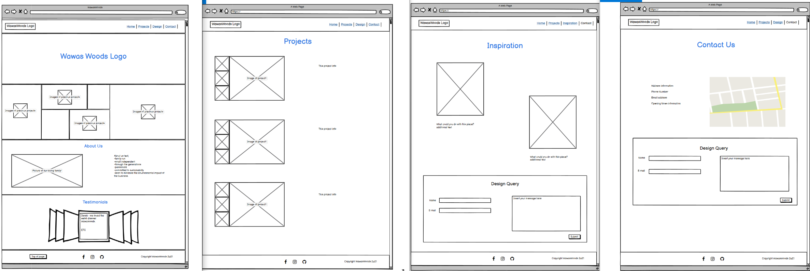
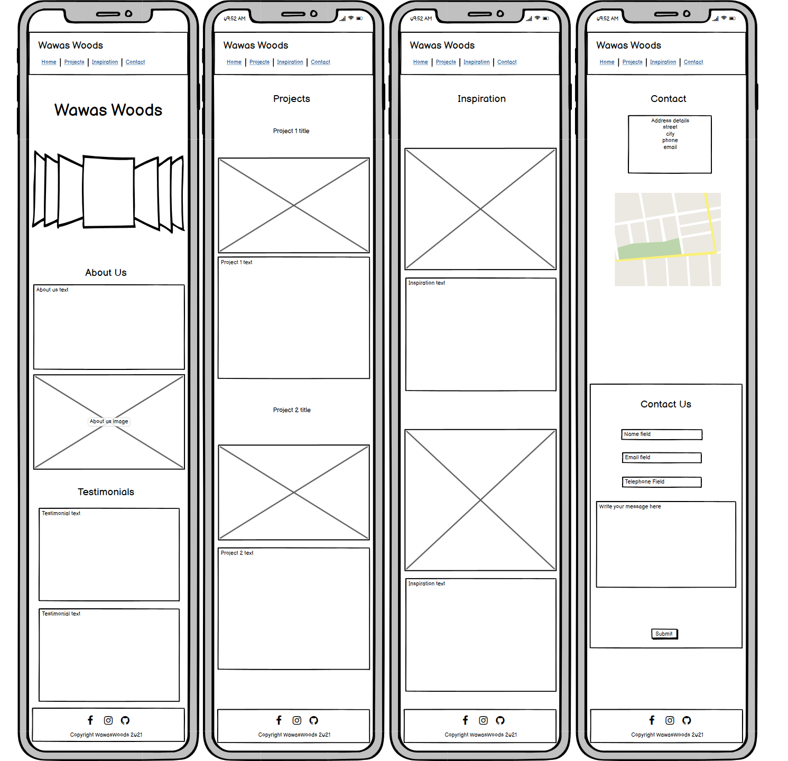
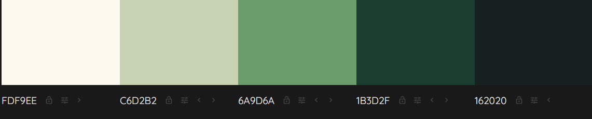
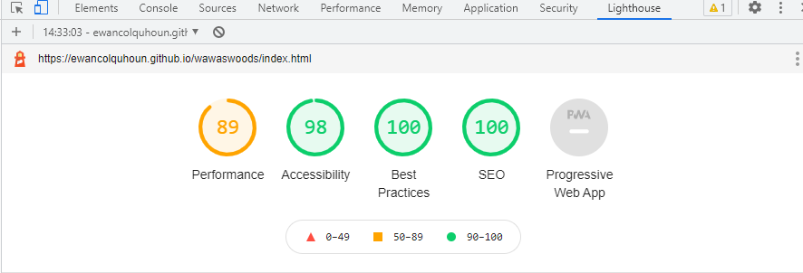

# **Wawas Woods**

Wawas Woods is a small business set up to create custom made wooden items. The site is targeted at the prospective buyer who is in the market for something tailored to their exacting requirements. Wawas Woods will be useful to help guide people through from project inception to delivery.

Welcome to the journey through <a href="https://ewancolquhoun.github.io/wawaswoods/index.html" target=_blank>Wawas Woods</a>

# Contents

* [**User Experience UX**](<#user-experience-ux>)
    *  [User Stories](<#user-stories>)
    * [Wireframes](<#wireframes>)
    * [Site Structure](<#site-structure>)
    * [Design Choices](<#design-choices>)
    *  [Typography](<#typography>)
    *  [Colour Scheme](<#colour-scheme>)
* [**Features**](<#features>)
    * [**Home**](<#navigation-menu>)
         * [Navigation menu](<#navigation-menu>)
         * [Gallery](<#gallery>)
         * [About-us](<#about-us>)
         * [Testimonials](<#testimonials>)
         * [Footer](<#footer>)
    * [**Projects**](<#projects>)
        * Dolls Cots
        * Height Chart
        * Walker
    * [**Inspiration**](<#inspiration>)
        * Elm
        * Oak
        * Elm
    * [**Contact Us**](<#contact-us>)
       * Contact details
       * Location map
       * Design Query form
    * [**Future Features**](<#future-features>)
* [**Testing**](<#testing>)
* [**Deployment**](<#deployment>)
* [**Credits**](<#credits>)
    * [**Content**](<#content>)
    * [**Media**](<#media>)
*  [**Acknowledgements**](<#acknowledgements>)

# User Experience (UX)

## User Stories

* As a user I want to be able to navigate through the whole site smoothly.
* As a user I want to understand the purpose of the site upon loading it.
* As a user I want to easily be able to contact Wawas Woods for more information.

[Back to top](<#contents>)

## Wireframes

The wireframes for Wawas Woods were produced in [Balsamiq](https://balsamiq.com). There are frames for a full width display and a small mobile device. The final site varies slightly from the wireframes due to developments that occured during the creation process. 

 

[Back to top](<#contents>)

## Site Structure

Wawas Woods website has four pages. The [home page](/index.html) is the default loading page, [projects](/projects.html), [inspiration](/inspiration.html) and [contact](/contact.html) pages are all accessible primarily from the navigation menu. There is another link to the contact page in the 'About-us' section to give the user some guidance to the next step of the journey. 
On every page there is also a 'back to the top arrow' in the bottom left corner.

[Back to top](<#contents>)
## Design Choices

 * ### Typography
      The fonts chosen were 'Caveat' for the headings and 'Lato' for the body text. They fall back to cursive and sans-serif respectively. 
     *  'Caveat' was chosen for the headings to give the user an inital welcoming feel. The cursive style generally feels more inviting and less intimidating for the user than others.
      * 'Lato' is used for the body text as it provides a nice contrast to the cursive whilst being easy to read for all.

 * ### Colour Scheme
      The colour scheme eventually chosen is one based on green and off-white. The colours contrasts with the wood colour in many of the images. 

[Back to top](<#contents>)
# Features

Wawas Woods site is set up to be welcoming and easy to use. It contains many features that the user would probably be familiar with, such as a navigation bar and contact form. The overall feel of the website is intended to be inviting and not intimidating to encourage the user to explore further. 

## Existing Features  
  * ### Navigation Menu

    * Sited at the top of all the pages in the site, it is fully responsive and contains links to all the pages of the site to enable ease of navigation in one convenient location.
    * The logo is clickable with a link back to the home page for enhanced UX.

[Back to top](<#contents>)

  * ### Gallery

      * Located on the home page beneath the title section. It was intended to make the title section relatively plain to enable a focus on the images in the gallery.
      * A responsively styled grid of images of past projects to give the user an idea of what is possible. 

[Back to top](<#contents>)

  * ### About-Us
    * The About Us section lets the user know what Wawas Woods is and who we are. 
    * The combination of a family picture and the text will draw the user in further by instilling a confidence that the project will be taken care of by a small family business.
    * An inbedded link to the contact section in the text will help the user navigate quickly to the next step of the project process.

[Back to top](<#contents>)

  * ### Testimonials

    * The testimonials section provides the user with some feedback from previous clients. There are three testimonials displayed giving a name, project name and some text.
    * They are styled with a box shadow to 'detach' them from the site to instill a sense of impartiality in the user.

[Back to top](<#contents>)

* ### Footer
    
    * Contains social media links. To enhance the UX the links open in other tabs.
    * The social media presence will help the user with their research into Wawas Woods and will also encourage them to connect with Wawas Woods.
    * To help the user with navigation on all devices a 'scroll to the top' arrow was added. It sticks to the bottom left of the screen at all times to give the user a quick and unobstructed way to the navigation bar. The arrow is semi-transparent with a light/dark contrasting border for use against all background colours.
    

[Back to top](<#contents>)

* ### Projects

    * The projects page give the user an idea of the recent projects that have been worked on. It also shows a number of different wood working techniques and finishes to help inspire the user's design.
    * There are images of the recent projects. To help enhance the UX two slideshows have been added to allow the user to see more images of two of the pieces.
    * This section would be up-dated periodically to reflect new recently finished projects.

[Back to top](<#contents>)

* ### Inspiration
    * The inspiration page is mainly there to demonstrate how a project starts and what is required to transform it into a finished project. It should inspire the user with the images of unfinished wood and get the user to imagine how that would look as a finished product.
    * It also contains a brief description of how the project would be constructed to give the user a rough idea of what goes on behind the scenes.

[Back to top](<#contents>)

* ### Contact Us

    * This section should complete the online journey for the user. It has a map (location of real life workshop not shown due to privacy reasons), address, phone number and email address details.
    * In case the user would like to contact Wawas Woods directly there is an e-mail link icon. It opens the users default email provider with an email addressed to Wawas Woods.
    * There is a form that the user can choose to fill in. It has a 5 input fields, name, email, address, callback and a textarea. The call back button lets Wawas Woods know if the user would like a callback.

[Back to top](<#contents>)

## Future Features 

* A 'Shop' section for projects that have been completed and are ready for purchasing.
    * This would incorporate an e-commerce platform and an enhanced gallery page.
* An option to live stream the workshop.
    * Particularly of interest to those whose projects are underway.
* Introduce swipe actions for use on mobile devices for the project sliders.

[Back to top](<#contents>)

# Testing

The Wawas Woods site has be throughly tested. All the code has been run through the [W3C html Validator](https://validator.w3.org/) and the [W3C CSS Validator](https://jigsaw.w3.org/css-validator/) and no errors were returned for both. 

The next level of testing consisted of using [Google Lighthouse](https://developers.google.com/web/tools/lighthouse) in Chrome Developer Tools to test each of the pages for:
* Performance - How the page performs whilst loading.
* Accessibility - Is the site acccessible for all users and how can it be improved.
* Best Practices - Site conforms to industry best practices.
* SEO - Search engine optimisation. Is the site optimised for search engine result rankings.

The results for Wawas Woods are below:

This part of the testing process showed up that the site was slow to load, mainly due to the image sizes. All the images needed to be compressed before adding to the repository. Once this was done the performance went from ~60% to ~90%. 

The form, whilst fictional it is still functional. You can input data and will be directed to a holding page until further navigation is selected. 

As Wawas Woods site is fully responsive, it has been tested on most of the mainstream sizes of browsers. Widescreen desktop, ipad and mobile phone size. 

The site has aslo been beta tested by peers and previous customers of the company.

## Bugs
Whilst testing the page on Safari it was noticed that some CSS wasn't displaying correctly. After some investigation it was deceided to target the CSS that wasn't safari compatible and format it correctly for Safari. 

During validator testing it was found that two end paragraph element tags were not recognised. After further investigation it appeared that the UL element inside the paragraph was conflicting and had hidden the end paragraph tags. Moving the UL outside the paragraph solved this bug.

## Unsolved Bugs
The form, on the face of it acts like you would expect it to, it acknowledges your data input, however the data doesn't push anywhere. This is a limitation within this project and would be rectified for a true deployment of the Wawas Woods site.

[Back to top](<#contents>)

# Deployment

The site was deployed to GitHub pages. The steps to deploy a site are as follows:
  * In the GitHub repository, navigate to the Settings tab.
  * Once in Settings, navigate to the Pages tab on the left hand side.
  * Under Source, select the branch to master.
  * Once the master branch has been selected, the page will be automatically refreshed with a detailed ribbon display to indicate the successful deployment.

  The live link to the Github repository can be found here - https://github.com/EwanColquhoun/wawaswoods

[Back to top](<#contents>)

# Credits
### Content

* The font came from [Google Fonts](https://fonts.google.com/).
* The colour palate was compiled by [Colormind](http://colormind.io/).
* The icons came from [Font Awesome](https://fontawesome.com/).
* The form validation idea came from a [YouTube tutorial](https://www.youtube.com/watch?v=fNcJuPIZ2WE).
* The code for the Safari specific styling was inspired by an example on [Stack Overflow](https://stackoverflow.com/).
* The code for the Project Sliders came from this example on [The Code Player](https://thecodeplayer.com/walkthrough/css3-image-slider-with-stylized-thumbnails).

### Media
* The photos all came from the developer, [Ewan Colquhoun](https://www.linkedin.com/in/ewan-colquhoun-2b3535213/).
* The photos were compressed using [Compressor](https://compressor.io/).

[Back to top](<#contents>)

# Acknowledgements
The site was completed as a Portfolio 1 Project piece for the Full Stack Software Developer (e-Commerce) Diploma at the [Code Institute](https://codeinstitute.net/). As such I would like to thank my mentor Precious Ljege, the Slack community, and all at the Code Institute for their help and support. Wawas Woods is a fictional company but it exists in everything but the business title. Currently it is more of a hobby!

Ewan Colquhoun 2021.

[Back to top](<#contents>)