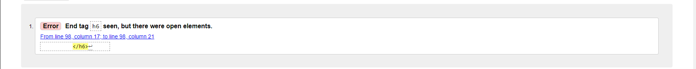
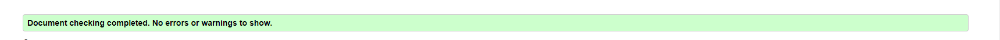
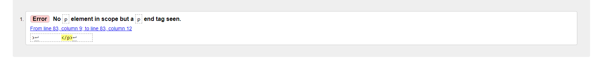
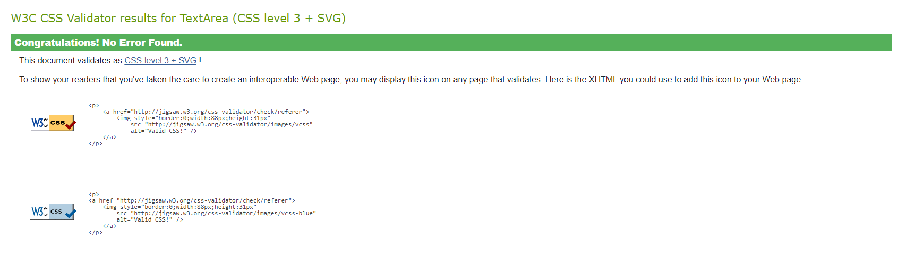
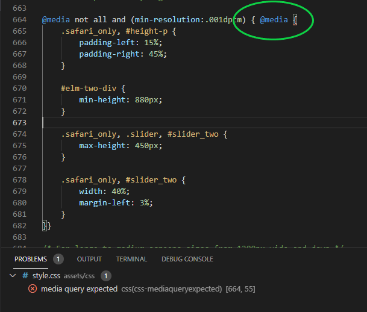
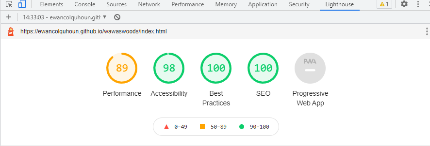

# Testing
## Code Validation
The Wawas Woods site has be throughly tested. All the code has been run through the [W3C html Validator](https://validator.w3.org/) and the [W3C CSS Validator](https://jigsaw.w3.org/css-validator/). Minor errors were found on the home and inspiration pages. After a fix and retest, no errors were returned for both. 

The HTML validator results for each page are below:

* Home page

This was an oversight from the development phase when the font size was being modified. It was easily fixed by using the correct closing tag, \</h5>.

* Projects page

* Inspiration page

This problem highlighted that the \<UL> was inside the \
 element. It was easily fixed by ensuring that the list was outside of the paragraph.

* Contact page

The CSS validator results are below:

## Responsiveness Test

* The responsive design tests were carried out manually with [Google Chrome DevTools](https://developer.chrome.com/docs/devtools/) and [Responsive Design Checker](https://www.responsivedesignchecker.com/).

|        | Moto G4 | Galaxy S5 | iPhone 5 | iPad | Display <1200px | Display >1200px |
|--------|---------|-----------|----------|------|-----------------|-----------------|
| Render | pass    | pass      | pass     | pass | pass            | pass            |
| Images | pass    | pass      | pass     | pass | pass            | pass            |
| Links  | pass    | pass      | pass     | pass | pass            | pass            |

Note: On wide display types the contents of the site are restricted in width to 2000px. This helps the UX by not spreading the content too wide on the extra wide screens.

## Browser Compatibility

Wawas Woods site was tested on the following browsers with no visible issues for the user. 
Google Chrome, Microsoft Edge, Safari and Mozilla Firefox. Responsiveness was consistent throughout for a range of device sizes.

## Testing User Stories

* As a user I want to be able to navigate through the whole site smoothly.
    * Navigation is at the top of every page in the form of the **navigation menu**.
    * In the about us section, there is an additional link to the **contact us** page.
    * On every page there is also a **scroll up arrow** to ease the route to the navigation menu.

     
* As a user I want to understand the purpose of the site upon loading it.
    * On the home page, the heading **'Bespoke wooden designs'** combined with the images in the **gallery** should allow the user to interpolate the main purpose of the site.

     
* As a user I want to easily be able to contact Wawas Woods for more information.
    * On the **contact** page there are contact details. There is also a quick link via an **e-mail icon** to send Wawas Woods an e-mail.
    * On the **contact** page there is also a **form** for ease of contact.

     
* As a user I want to see existing pieces of Wawas Woods' work.
    * On the home page there is the responsive **gallery** section.
    * Additionally one of the pages is the **projects** page. This has images and a brief descripton of the project. and will be updated regularly as projects reach completion.

     
* As a user I want to know more about Wawas Woods.
    * On the home page there is the **about us** section. This gives a brief description on who Wawas Woods are.

     
* As a user I want to know how other peoples' experiences with Wawas Woods have been.
    * At the bottom of the home page there are some **testimonials** from previous customers.

     
* As a user I want to connect with Wawas Woods on social media.
    * In the **footer** of every page there are some **social media links** to Wawas Woods social media pages.

     
* As a user I want to know the process of converting some wood into a finished project.
    * One of the pages is an **inspiration** page. It is designed to give the user an idea of how projects start out and what they could potentially become.
    * On the **inspiration** page there are also simplistic descriptions for the methods of constructing the suggested projects.

## Known Bugs
* The form, on the face of it acts like you would expect it to, it acknowledges your data input, however the data doesn't push anywhere. This is a limitation within this project and would be rectified for a true deployment of the Wawas Woods site.
* In the gitpod editor console one problem flags up within the CSS. To enable the site to perform properly on all versions of Safari a 'media query with a blank 'media@' is used. This flags up as an error but infact doesn't affect the sites functionality in its present form. For future development I would link another stylesheet with safai specific styling to load when Safari is used.
    
    

## Additional Testing
### Lighthouse
The site was also tested using [Google Lighthouse](https://developers.google.com/web/tools/lighthouse) in Chrome Developer Tools to test each of the pages for:
* Performance - How the page performs whilst loading.
* Accessibility - Is the site acccessible for all users and how can it be improved.
* Best Practices - Site conforms to industry best practices.
* SEO - Search engine optimisation. Is the site optimised for search engine result rankings.

As an example the results for Wawas Woods home page are below:

This part of the testing process showed up that the site was slow to load, mainly due to the image sizes. All the images needed to be compressed before adding to the repository. Once this was done the performance went from ~60% to ~90%. 

### Peer review
In addition to the above testing the beta version of the site was put through its paces by peers, both in the software development field and outside. The results highlighted responsive design weakness for a type of mobile device that was rectified with minor CSS amendments. There were also minor spelling and grammar errors that have since been fixed.

Back to [README.md](./README.md#testing).